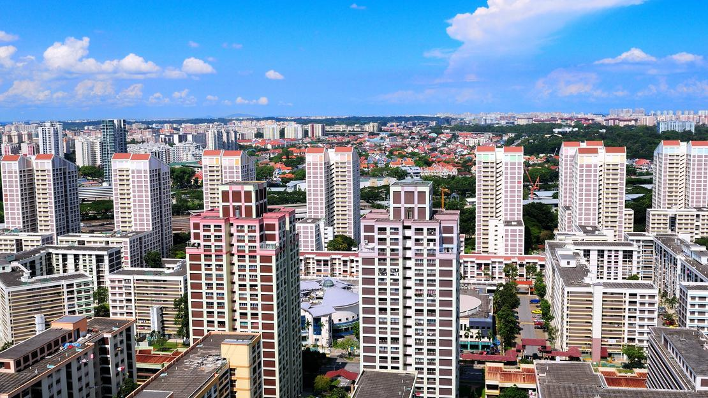

<h1> Singapore_Resale_Flat_Prices_Predicting </h1>


<h1 align="center">
  <br>
  <a href=""></a>
  <br>
 
  <br>
</h1>


<p align="center">
  <a href="#Introduction"></a>
  <a href="#Technologies Applied"></a>  
</p>

Video Link: [Linked-IN Video](https://www.linkedin.com/posts/keerthi-r-9b8839283_project-name-singapore-resale-flat-prices-activity-7296605369458405377-5IGf?utm_source=share&utm_medium=member_desktop&rcm=ACoAAEUARVwBltI0ri4ApeK7YzcbHxGViaHfWEM)

Portfolio: [Nambu Keerthi](https://portfolio-b5zieg8xn5nhwau5b4bhp8.streamlit.app/)

## Introduction 
This project will develop a machine learning model to predict the resale values of apartments in Singapore. The model will be implemented as a user-friendly online application to help buyers and sellers estimate a flat's worth based on past transactions.

**Domain** : *Real Estate*

## Technologies Applied
* python
* streamlit 
* Pandas 
* Numpy
* Skikit-Learn 


## Project Setup
1. Firstly install all the required extensions in the requirements.txt
```
pip install -r requirements.txt
```

2. Second get the Data from the Data source and Load the data for Data cleaning and Pre Processing. Then finding the outliers for removing then make it visible the dataset columns by using matplotlib, plotly_express and seaborn.
```
import pandas as pd
import numpy as np
import matplotlib.pyplot as plt
import seaborn as sns
import plotly.express as px
import plotly.graph_objects as go
import plotly.io as pio
```

3. After that should make heatmap visualization to knowning how data values are spreaded there.
```
plt.figure(figsize=(15,10))
sns.heatmap(corrm, annot=True,cmap='coolwarm',fmt='.2f')
plt.show()     
```

4. Then split the dataset as well as train and test data for creating ML models. Save the models in ".pkl" file.
```
from sklearn.ensemble import RandomForestRegressor
from sklearn.model_selection import train_test_split
from sklearn.model_selection import cross_val_score
from sklearn.metrics import mean_absolute_error,mean_squared_error, r2_score
```

5. To run the application
```
streamlit run main.py
```

   
## Project Methodology

**Resale Price Prediction**

1. Select the "Predictions" option menu.

2. Fill in the following required informations.

3. Click the "RESALE PRICE" button.

4. The app will display the predicted selling price based on the provided information.
